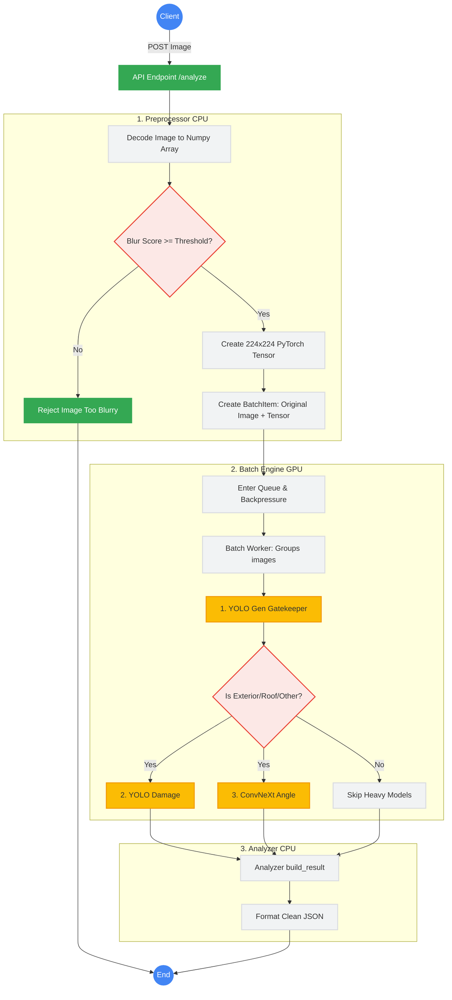

# System Architecture & Design Document
**Project:** ConnectCar API (ระบบ AI ตรวจสอบมุมรถยนต์)

เอกสารฉบับนี้อธิบายโครงสร้างสถาปัตยกรรมระบบ (System Architecture) ของโปรเจกต์ ConnectCar API อย่างละเอียด เพื่อใช้เป็นคู่มือสำหรับนักพัฒนาและเอกสารอ้างอิงสำหรับการนำเสนอโครงสร้างระบบ (System Design)

---

## 1. ภาพรวมของระบบ (High-Level Architecture)

ระบบถูกออกแบบด้วยสถาปัตยกรรมแบบ **Client-Server Architecture** โดยมุ่งเน้นประสิทธิภาพการประมวลผล AI ขั้นสูง (High-Performance AI Inference) ภายในโหนดเดียว (Single-Node Optimization) โดยใช้ In-Process Async Queue เพื่อลดความหน่วง (Network Latency) แทนการใช้ External Queue (เช่น Redis) เนื่องจากการส่งผ่านข้อมูลรูปภาพ (Tensor) ขนาดใหญ่ข้ามเครือข่ายมีต้นทุนสูง



---

## 2. เครื่องมือและเทคโนโลยีที่ใช้ (Technology Stack)

### 🖥️ Frontend (UI & Presentation)
*   **Framework:** React 19 + Vite 8
*   **Styling:** TailwindCSS 4
*   **Routing:** React Router v7
*   **หน้าที่หลัก:** เป็นส่วนติดต่อผู้ใช้ (UI) สำหรับให้ User อัปโหลดรูปภาพ (ถ่ายรูปหรือเลือกจากอัลบั้ม), ระบุมุมที่คาดหวัง, และแสดงผลการวิเคราะห์จากระบบ AI

### ⚙️ Backend (API & Business Logic)
*   **Framework:** FastAPI (Python 3.10)
*   **Server:** Uvicorn (ASGI)
*   **หน้าที่หลัก:** เปิดรับ API Request, ตรวจสอบความถูกต้องของข้อมูล (Validation), บริหารจัดการคิวงาน (Queue Management) ไม่ให้ระบบ Overload, และส่ง Response กลับไปยัง Client

### 🧠 AI Models (Inference Layer)
*   **Framework:** PyTorch (timm, Ultralytics), OpenCV
*   **Model 1 (Angle Detection):** `ConvNeXt Small` ทำหน้าที่จำแนกมุมรถยนต์ 8 ทิศทาง
*   **Model 2 (Vehicle Verification):** `YOLOv8n` ทำหน้าที่ยืนยันว่ามีรถในภาพจริงหรือไม่ และช่วยคำนวณระยะห่างของรถจากสัดส่วนพื้นที่ (Car Area Ratio)

---

## 3. ขั้นตอนการทำงานภายใน (Internal Data Flow)

เมื่อ Client ทำการส่ง Request รูปภาพเข้ามา ระบบจะประมวลผลตามลำดับดังนี้:

1.  **Request Reception:** FastAPI รับ `POST /api/v1/analyze` พร้อมไฟล์รูปภาพและ `expected_view`
2.  **Backpressure Check:** ตรวจสอบว่าคิวงานเต็มหรือไม่ (Max Queue = 200) หากเต็มจะตอบกลับ HTTP 429 ทันทีเพื่อป้องกันเซิร์ฟเวอร์ล่ม (Overload Protection)
3.  **Validation & Preprocessing:** 
    *   ใช้ OpenCV อ่านไฟล์ภาพและคำนวณค่าความเบลอ (Variance of Laplacian)
    *   แปลงภาพเป็น Tensor ขนาด 224x224 (Normalize)
4.  **Queue Submission:** นำ Tensor ส่งเข้า In-Process Async Queue 
5.  **Batch Processing:** Worker Thread กวาดรูปจาก Queue (สูงสุด 32 รูป หรือรอไม่เกิน 20ms) มัดรวมเป็น 1 Batch เพื่อการประมวลผลที่คุ้มค่าที่สุด
6.  **Dual-Model Inference:** 
    *   ส่ง Batch เข้า `ConvNeXt` เพื่อหา % ความน่าจะเป็นของมุมรถ
    *   ส่ง Batch ภาพเข้า `YOLO` เพื่อหา Bounding Box
7.  **Result Building & Post-Processing:** นำผลจาก 2 โมเดลมาเทียบเคียงกัน 
    *   เช็คว่ามุมตรงไหม (`match`)
    *   รูปเบลอไหม (`is_blurry`)
    *   รถอยู่ไกลไปไหม (`is_too_far`)
8.  **Response:** คืนค่า JSON กลับสู่ Frontend

---

## 4. ส่วนประกอบหลักที่ซับซ้อน (Core Component Design)

ระบบนี้ไม่ได้ทำการรัน AI แบบทื่อๆ (Sequential) แต่มีกลไกทางวิศวกรรมซอฟต์แวร์เข้ามาช่วยจัดการ 3 ส่วนหลัก:

1.  **Batch Inference Engine:** 
    เพื่อรองรับการใช้งานที่พร้อมกันจำนวนมาก ระบบมี Worker ที่คอยรวบรวม Request ที่เข้ามาไล่เลี่ยกัน มัดเป็นกลุ่ม (Batching) แล้วส่งให้ CPU/GPU คำนวณรวดเดียว ทำให้ Throughput (ปริมาณงานที่ทำได้) สูงขึ้นอย่างมหาศาล
2.  **Backpressure Gate (Fail-fast mechanism):**
    ป้องกันปัญหาระบบค้าง (System Hang) เมื่อมีผู้ใช้งานเกินกว่าที่ Hardware จะรับไหว โดยการล็อคคิวและปฏิเสธ Request ส่วนเกินตั้งแต่หน้าด่าน
3.  **Dual-Model Verification (ระบบตรวจทาน 2 ชั้น):**
    ป้องกัน False Positive (คนอัปโหลดรูปหมาแมว หรือของเล่น) โดย ConvNeXt จะทำหน้าที่ทายมุม ส่วน YOLOv8 จะทำหน้าที่เป็นตัวคัดกรอง (Gatekeeper) ว่าสิ่งนั้นคือยานพาหนะจริงๆ หรือไม่

---

## 5. การออกแบบ API (API Design)

### 📌 Endpoint: `POST /api/v1/analyze`
**📥 Request (multipart/form-data)**
```text
file: <binary_image_file>
expected_view: "Front"
```

**📤 Response (JSON - Success)**
```json
{
  "status": "success",
  "prediction": {
    "label": "Front",
    "confidence": 98.5
  },
  "is_car": true,
  "match": true,
  "quality": {
    "is_blurry": false,
    "blur_score": 120.4,
    "is_too_far": false,
    "car_area_ratio": 0.45
  },
  "time_ms": 85.2
}
```

---

## 6. Performance Benchmark (ผลการทดสอบประสิทธิภาพ)

ระบบได้ผ่านการทำ Load Test เพื่อวัด Latency ของ API (`/api/v1/analyze`) โดยการส่งรูปภาพเดี่ยวเข้ามาประมวลผลจำนวน **200 Requests ต่อเนื่อง** ได้ผลลัพธ์ดังกราฟต่อไปนี้:

*   **Average Response Time (ค่าเฉลี่ย):** `0.154 วินาที (154 ms)`
*   **Min Response Time (เร็วสุด):** `0.129 วินาที (129 ms)`
*   **Max Response Time (ช้าสุด):** `0.214 วินาที (214 ms)`

**บทสรุปด้านประสิทธิภาพ:** 
ระบบสามารถรักษาความเสถียร (Consistency) ได้อย่างดีเยี่ยม ค่า Latency แกว่งอยู่ในกรอบแคบๆ (0.13s - 0.21s) **ไม่มีอาการสะดุดหรือค้าง (No extreme latency spikes)** แม้จะยิงโหลดอย่างต่อเนื่อง แสดงให้เห็นว่าสถาปัตยกรรม In-Process Async Queue สามารถบริหารจัดการคิวและรีดประสิทธิภาพของการทำ AI Inference (2 โมเดลพร้อมกัน) ออกมาได้นิ่งและเสถียรมาก

---

## 7. สถาปัตยกรรมการวางระบบ (Deployment Infra)

ปัจจุบันระบบถูกแพ็กเกจด้วย **Docker** ให้อยู่ในรูปแบบ Container เพื่อให้สามารถนำไปรันบน Environment (Dev/Prod) ใดก็ได้โดยไม่ต้องตั้งค่าใหม่

*   **Dockerfile:** สร้าง Image จาก `python:3.10-slim` พร้อมติดตั้ง Dependencies ของ AI (`libgl1`, `torch`, `opencv`)
*   **Docker Compose:** จัดการรัน Container โฮสต์พอร์ต `8000:8000`

**🚀 การขยายระบบในอนาคต (Future Scaling):**
หากองค์กรต้องการรองรับผู้ใช้งานหลักหมื่นคนพร้อมกัน (Horizontal Scaling) สามารถปรับสถาปัตยกรรมโดยดึง Queue ออกมาเป็น External Service ได้ดังนี้:
`Client -> API Gateway (Nginx) -> FastAPI Nodes -> Redis Message Queue -> GPU Worker Nodes`

